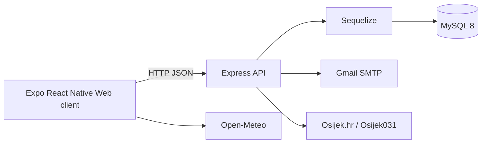

# Projektna dokumentacija

## 1. Svrha

Osijek Info Kiosk je interaktivni gradski informacijski sustav za javni kiosk. Korisniku omogućuje pregled turističkih znamenitosti, muzeja, događanja, gradskih usluga, smještaja, trgovina, karte, vremena i kontakta s gradonačelnikom.

Projekt podržava hrvatski i engleski jezik te je prilagođen velikom zaslonu i radu bez korisničke prijave. Primarna ciljna rezolucija kiosk sučelja je `1920 x 1080`, uz responzivno skaliranje za druge veličine zaslona.

## 2. Arhitektura



### 2.1 Klijent

Ulazna datoteka je `client/src/app/index.tsx`. Klijent upravlja screensaverom, jezikom, temom, aktivnom karticom, dohvatom podataka, modalima i statusom API veze.

Glavne cjeline su `components/views`, `components/widgets`, `components/common`, `context`, `config`, `services` i `utils`. API adresa centralizirana je u `client/src/services/api.ts`; zadana vrijednost je `https://osijek-info-kiosk.onrender.com`, a može se promijeniti s `EXPO_PUBLIC_API_URL`.

### 2.2 Server

Ulazna datoteka je `server/server.ts`. Server pokreće Express, CORS i JSON parser, inicijalizira bazu, sinkronizira modele, poslužuje podatke, obrađuje vanjske izvore i kontakt-formu te pokreće dnevnu provjeru vijesti i događanja. Zod shema kontakt-forme nalazi se u `server/schemas/contactSchema.ts`, a email predlošci u `server/utils`.

### 2.3 Baza

MySQL radi kao Compose servis `database`, a Sequelize upravlja modelima i relacijama:

- `Item` - glavne stavke sadržaja
- `ItemGallery` - dodatne slike
- `GppLine` - linije javnog prijevoza
- `GppDeparture` - polasci
- `MapLocation` - točke na karti

## 3. Funkcionalne cjeline

### Početni ekran

Prikazuje logo, naziv grada, sat, prognozu, ticker vijesti i navigacijske kartice. Nakon 60 sekundi neaktivnosti vraća aplikaciju u screensaver.

### Turizam i muzeji

Turistički sadržaj podijeljen je na znamenitosti i muzeje. Klik otvara naslov i veliki opis. QR se za ove kategorije ne prikazuje.

### Događanja

Događaji se učitavaju iz baze i vanjskog izvora Osijek031. Korisnik mijenja mjesec, a detalji se dohvaćaju preko servera.

### Usluge i imenik

Kategorije su zdravstvo, javni prijevoz, taksi, gradske usluge, smještaj i trgovine. Za zdravstvo, gradske usluge, smještaj i trgovine modal prikazuje opis bez QR koda. GPP, željeznički kolodvor i eMobi imaju posebne widgete.

### Karta

`MapTab` dohvaća lokacije iz `/api/locations`, prikazuje ih na karti i otvara opis, vrijeme hoda i Google Maps poveznicu.

### Kontakt gradonačelnika

Kontakt-forma podržava anonimne i neanonimne poruke. Neanonimna poruka prolazi provjeru blokade emaila, Zod validaciju, rate limiting i email potvrdu prije slanja.

## 4. Tok pokretanja

```text
Docker Compose
  -> MySQL healthcheck
  -> server initializeDatabase()
  -> Sequelize sync({ alter: true })
  -> seed ako nema Item zapisa
  -> Express listen na Render PORT-u ili portu 5000 lokalno
  -> Expo web klijent na Render Static Siteu ili portu 8081 lokalno
```

Pokretanje:

```powershell
Copy-Item server\.env.example server\.env
docker compose up --build
```

| Servis | Funkcija | Port |
| --- | --- | --- |
| `database` | MySQL 8 | `3307` host / `3306` mreža |
| `server` | Express API | Render `PORT` / `5000` lokalno |
| `client` | Expo web klijent | Render Static Site / `8081` lokalno |

## 5. Seed podaci

`server/seed.ts` sadrži demo sadržaj, događanja i lokacije. Ručno seedanje briše postojeće tablice i ponovno ih puni, pa je namijenjeno samo razvoju i demonstraciji.

```bash
docker compose stop server
docker compose run --rm server node --import tsx -e "import('./seed.ts').then(({ seedDatabase }) => seedDatabase())"
docker compose up -d server client
```

## 6. Vanjske integracije

- Open-Meteo: vremenska prognoza
- WordPress API Grada Osijeka: vijesti
- Osijek031: događanja i opisi
- Google Maps: karta i navigacija
- Gmail SMTP: kontakt i verifikacija

Ako vanjski izvor ne uspije, lokalni podaci iz baze ostaju dostupni gdje je to moguće.

## 7. Sigurnost

- `server/.env` je lokalna datoteka i ne smije se commitati.
- `.env.example` sadrži samo primjerne vrijednosti.
- Kontaktni payload provjerava Zod, a ruta ograničava uspješna slanja na 3 poruke s istog uređaja u 15 minuta. Neuspjeli pokušaji ne troše limit.
- Za produkciju koristiti HTTPS, zasebnog DB korisnika i zatvoren MySQL port.
- Razvojne vrijednosti `root/root` nisu primjer za produkciju.
- `PUBLIC_SERVER_URL` mora biti dostupna uređaju koji otvara email.

## 8. Provjera

```bash
npm run lint --prefix client
npm run build --prefix server
curl http://localhost:5000/api/health
```

Health odgovor mora sadržavati `status: online`.

## 9. Operativne napomene

- Kiosk pokrenuti u fullscreen browseru ili na namjenskom uređaju.
- Zadani produkcijski API URL je `https://osijek-info-kiosk.onrender.com`; za lokalni Docker koristi se `http://localhost:5000`.
- Pri promjeni API hosta ažurirati `EXPO_PUBLIC_API_URL` i ponovno izgraditi client.
- Za email potvrdu `PUBLIC_SERVER_URL` mora biti javni HTTPS URL Render Web Servicea koji obrađuje `/api/verify-email`.
- Prije javne objave promijeniti razvojne lozinke i ograničiti mrežni pristup.

## 10. Moguća buduća poboljšanja

- administratorski panel ili CMS
- offline cache
- automatske migracije baze
- API i end-to-end testovi
- pristupačnost i dodatni jezici
- reverse proxy s HTTPS-om
